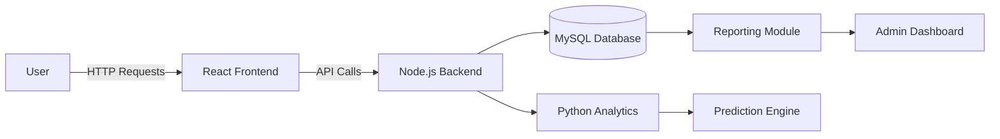

# Blood_Daan - Life-Saving Blood Donation Platform 🩸


## 🌟 Introduction
Blood_Daan is an innovative web platform that bridges the gap between blood donors and those in urgent need. Our system leverages geolocation technology to match donors with recipients in real-time, significantly reducing emergency response times during critical situations.

**Key Value Proposition:**
- ⏱️ Instant donor matching in your vicinity
- 🏥 Multi-user portal for donors, recipients, and blood banks
- 📱 24/7 accessibility with AI-powered support

## 🚀 Key Features

### For Donors
- ✍️ Easy registration with blood group and location
- 🔔 Emergency request notifications
- 🏆 Donor reward system

### For Recipients
- 🔍 Real-time donor search
- 🗺️ Interactive map view
- 📞 Direct communication channel

### For Blood Banks
- 📊 Inventory management
- 📈 Demand forecasting
- 🚨 Emergency alert system

## 🖥️ Screenshots

| Feature | Preview |
|---------|---------|
| **Registration** |  |
| **Donor Search** |  |
| **Connect Dashboard** |  |

## 🛠️ Technology Stack

**Frontend:**
- React.js with Hooks
- Bootstrap 5 for responsive design
- Google Maps API for geolocation
- React Icons for UI elements

**Backend:**
- Node.js with Express
- PHP for legacy endpoints
- Python for data processing

**Database:**
- MySQL (Primary)
- MongoDB (For chat logs)

**DevOps:**
- Docker containerization
- Linux server environment
- CI/CD pipeline

## 📥 Installation Guide

### Prerequisites
- XAMPP/WAMP ([Download XAMPP](https://www.apachefriends.org/download.html))
- Node.js v16+
- Python 3.8+
- MySQL 5.7+

### Step-by-Step Setup

1. **Server Configuration**
```bash
# Start Apache and MySQL
sudo /opt/lampp/lampp start
```

2. **Database Setup**
```sql
CREATE DATABASE blood_daan;
USE blood_daan;
-- Import provided SQL file through phpMyAdmin
```

3. **Backend Installation**
```bash
cd backend
npm install
cp .env.example .env
# Configure your environment variables
npm start
```

4. **Frontend Setup**
```bash
cd frontend
npm install
npm start
```

5. **Access the Application**
- Frontend: `http://localhost:3000`
- Admin Panel: `http://localhost/phpmyadmin`

## 🔧 System Architecture



## 🔮 Future Roadmap
- **Enhanced Matching Algorithm**: AI-based compatibility checking
- **Mobile App**: iOS and Android applications
- **Blockchain Integration**: Secure donor records
- **IoT Integration**: Blood storage monitoring
- **Gamification**: Donor achievement system

## 🤝 Contributing
We welcome contributions! Please follow these steps:

1. Fork the repository
2. Create your feature branch (`git checkout -b feature/NewFeature`)
3. Commit your changes (`git commit -m 'Add some feature'`)
4. Push to the branch (`git push origin feature/NewFeature`)
5. Open a Pull Request

## Usage  
Clone the repository:  
   ```bash
   git clone  https://github.com/tanvirhasanjewel/Blood_Daan.git
   ```

---
**Contact Us**: contact@blooddaan.org  
**Live Demo**: [https://demo.blooddaan.org](https://demo.blooddaan.org)  

[](https://github.com/tanvirhasanjewel/Blood_Daan/stargazers)
[](https://github.com/tanvirhasanjewel/Blood_Daan/issues)

💉 **Every donation counts - Be someone's hero today!** ❤️
